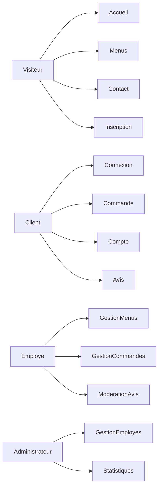
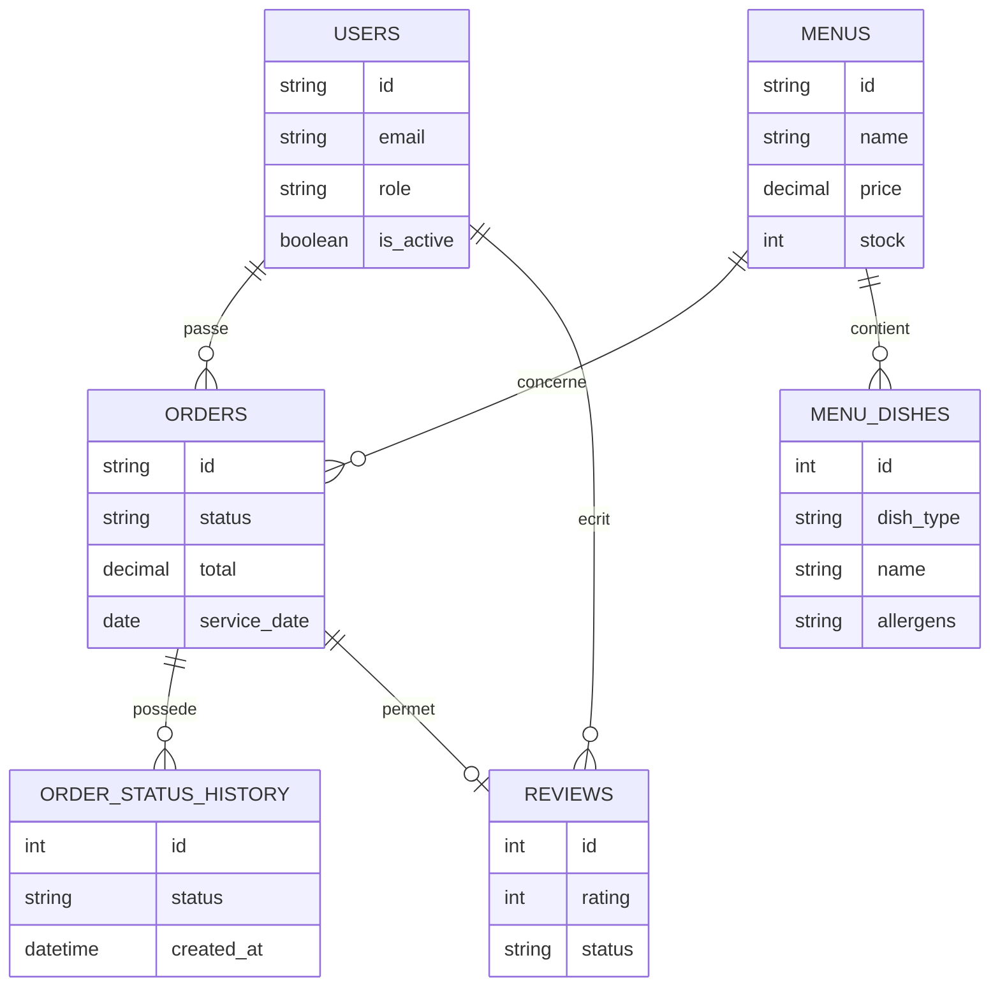
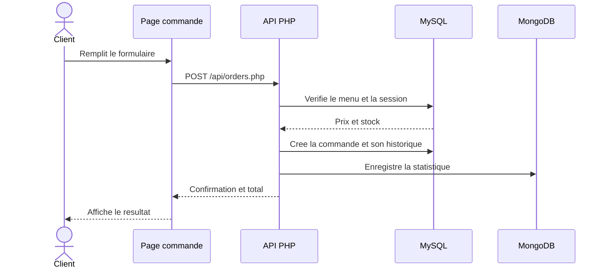

# Diagrammes

## Cas d'utilisation

```mermaid
flowchart LR
  Visiteur --> Accueil
  Visiteur --> Menus
  Visiteur --> Contact
  Visiteur --> Inscription
  Client --> Connexion
  Client --> Commande
  Client --> Compte
  Client --> Avis
  Employe --> GestionMenus
  Employe --> GestionCommandes
  Employe --> ModerationAvis
  Administrateur --> GestionEmployes
  Administrateur --> Statistiques
```

## Modele de donnees

```mermaid
erDiagram
  USERS ||--o{ ORDERS : passe
  USERS ||--o{ REVIEWS : ecrit
  ORDERS ||--o{ ORDER_STATUS_HISTORY : possede
  ORDERS ||--o| REVIEWS : permet
  MENUS ||--o{ ORDERS : concerne
  MENUS ||--o{ MENU_DISHES : contient
  USERS { string id string email string role boolean is_active }
  MENUS { string id string name decimal price int stock }
  MENU_DISHES { int id string dish_type string name string allergens }
  ORDERS { string id string status decimal total date service_date }
  ORDER_STATUS_HISTORY { int id string status datetime created_at }
  REVIEWS { int id int rating string status }
```

## Sequence d'une commande

```mermaid
sequenceDiagram
  actor Client
  participant Page as Page commande
  participant PHP as API PHP
  participant SQL as MySQL
  participant NoSQL as MongoDB
  Client->>Page: Remplit le formulaire
  Page->>PHP: POST /api/orders.php
  PHP->>SQL: Verifie le menu et la session
  SQL-->>PHP: Prix et stock
  PHP->>SQL: Cree la commande et son historique
  PHP->>NoSQL: Enregistre la statistique
  PHP-->>Page: Confirmation et total
  Page-->>Client: Affiche le resultat
```
